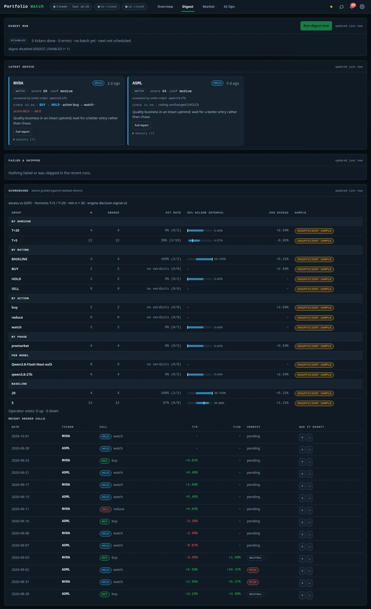

# Portfolio Dashboard

A single-user, LAN-only dashboard for a small EUR portfolio: live valuation, benchmark comparison,
alerts and push notifications, and a local-LLM analysis/digest pipeline running on shared GPU lanes.
FastAPI backend, vanilla ES-module frontend (no build step), deployed as a **rootless podman quadlet**
on Bazzite (Fedora Atomic) with an RTX 5090.

- UI: `http://<host>:8601` (HTTP Basic auth; `/health` is the only open route besides ntfy approval callbacks)
- Example setup: EU-listed holdings (ASML `ASML.AS`, NVDA `NVD.DE`, iShares Core S&P 500 UCITS ETF
  `SXR8.DE`) valued in **EUR**; the S&P 500 index (`^GSPC`) is a **benchmark only**. Everything is configurable.
- Agent/maintainer docs: [`AGENTS.md`](AGENTS.md) and [`skills/`](skills/).
- **Documentation with screenshots and a walkthrough video: [`docs/`](docs/README.md).**


<p align="center">
  <br>
  <sub>first 26 s · <a href="docs/media/video/walkthrough.mp4">full 60 s video (mp4)</a> also covers the alert center, digest, market, AI Ops and settings</sub>
</p>

| Holding detail | Alert center | Digest and scoreboard |
|---|---|---|
| [](docs/features/holding-detail.md) | [](docs/features/alerts.md) | [](docs/features/digest-and-scoreboard.md) |

*All media come from a demo instance with fictional positions – see [`docs/demo-data.md`](docs/demo-data.md).
More: [overview](docs/features/overview.md) · [analysis and reports](docs/features/analysis-and-reports.md) ·
[market](docs/features/market.md) · [AI Ops](docs/features/ai-ops.md) · [settings](docs/features/settings.md) ·
[mobile and themes](docs/features/mobile-and-themes.md).*


## What it does
| Area | Details |
|---|---|
| **Valuation** | `shares × EUR listing price`; day P/L, total P/L against EUR cost basis, weights, max drawdown; positions without a known cost basis are valued but excluded from P/L and flagged. |
| **Benchmark** | Portfolio vs S&P 500 (index converted to EUR with daily FX, because the ETF is unhedged), indexed to 0 % over 1M/3M/6M/1Y. |
| **Prices** | One authoritative series per holding (the EUR listing via Yahoo). US live feeds (Twelve Data / Finnhub WebSocket) are shown only as a labelled `usLive` reference. Venue-aware market hours. |
| **Alerts** | Session-move and gap-vs-previous-close alerts, user rules (EMA cross, RSI, volume spike, absolute level, earnings lead, short-ratio spike, market-light drop), news alerts with LLM triage, SEC Form 4 / 8-K insider alerts. |
| **Notifications** | ntfy with a durable outbox (retry/backoff), severity filter, quiet hours, dedupe; an in-app **alert center** with unread count and ack. Approval buttons use per-approval HMAC tokens. |
| **AI analysis** | In-process pipeline (analyst → research → trader → risk → PM) producing a structured decision (rating, action, score, confidence, battle plan). Quick / standard / deep modes; evidence pack where every field carries `as_of + source` or the literal `MISSING`. |
| **Digest** | Twice-daily consolidated push per batch; rating-based change detection; retries and failure reporting. |
| **Scoreboard** | Grades advice at T+5 / T+20 against the EUR-converted benchmark with Wilson intervals and an explicit "insufficient sample" rule. |
| **Chat assistant** | Streams from the active lane, grounded each turn on current quotes, position and latest advice. |
| **Market view** | Market light, macro (yield curve, FRED, CFTC COT), earnings calendar, insider feed, FINRA short volume, filings. |
| **AI Ops view** | Lane state (primary/fallback), LLM budget by purpose, worker health, job queue, triage log, approvals, evidence viewer. |

## Architecture
```
 browser ──HTTP/SSE──▶ portfolio-dashboard :8601  (FastAPI, static ES modules)
                         │  config/ (mount)   data/ (mount)   results/ (mount)
                         │
   data layer ───────────┤ Yahoo (listing series, ^GSPC, FX) · Twelve Data WS / Finnhub WS (usLive)
                         │ Frankfurter FX · FRED · Nasdaq calendar · SEC EDGAR · FINRA · CFTC · RSS/GDELT news
   alerts ───────────────┤ notify outbox ──▶ ntfy (aistock network) ──▶ phone (action buttons → /api/approvals/*)
   LLM ──────────────────┤ lane_client ──▶ ninfer-nvfp4 :8002 (qwen3.8-27b, primary)
                         │             └─▶ exllamav3  :8003 (Qwen3.8-Flash-Next, fallback)
   reports ──────────────┴ results/ ──▶ kb_sync ──▶ Open WebUI knowledge base (optional)
```
Only one heavy GPU lane runs at a time (host-side `lanes-switch` decides); the dashboard never starts or
stops lanes, it probes them (`~/.local/bin/gpu-lanes/lanes.conf`, mounted at `/app/lanes`) and uses the
first healthy one in `LANE_PREFERENCE` order.

Neighbouring services on the same host: ntfy (push), Open WebUI (`:3000`, optional knowledge base for
reports), Ollama (`:11434`), `host-dashboard` (`:8443`, GPU-lane control panel). The dashboard does not
depend on Ollama or Open WebUI to value the portfolio or send alerts.

### Internal modules
`registry` (what a ticker *is*) → `prices`/`live_ws`/`forex` (data) → `portfolio` (valuation) →
`rule_eval`/`price_alerts`/`news_alerts`/`edgar`/`market_light` (alert workers) → `notify` (outbox) →
ntfy. `lane_client` + `ta_pipeline` + `digest` + `scoreboard` form the LLM side. Every background worker
follows `start()/stop()/status()/close()` and is listed in `main.BACKGROUND_MODULES`. Details and
contracts: [`AGENTS.md`](AGENTS.md).

## Configuration
**`config/config.json`** — your real file, **gitignored**. Start from the tracked sample:
`cp config/config.example.json config/config.json`. It is a bind-mounted *directory*, edited by the UI or by hand;
read/written only via `config_store`, which keeps a last-good copy in `data/`:
```jsonc
{
  "watchlist": [ { "id": "ASML", "kind": "equity", "role": "holding", "quoteCurrency": "EUR",
                   "providers": { "yahoo": "ASML.AS", "twelvedata": "ASML", "finnhub": "ASML" },
                   "listing":   { "symbol": "ASML.AS", "venue": "XAMS", "currency": "EUR" } },
                 /* … SXR8 (etf), GSPC (index, role: benchmark; null providers = unsupported) */ ],
  "portfolio": { "ASML": { "shares": 2.5, "investedAmount": 2500.00 } },  // EUR; investedAmount may be null
  "alertRules": { "version": 2, "default": { "thresholdPct": 3.0, "hotPct": 5.0, "cooldownMin": 120 }, "perTicker": {} },
  "chatModel": "lane", "aliases": { "ASML": ["asml", "euv"] }
}
```
**`env.secrets`** (gitignored systemd `EnvironmentFile`; never print it): Basic-auth user/password,
`APPROVAL_TOKEN`, `NTFY_PASS`, provider keys (`FINNHUB_API_KEY`, `TWELVE_DATA_API_KEY`, `FRED_API_KEY`),
`OPEN_WEBUI_API_KEY`, and feature gates.

Feature gates / tuning (defaults in code; `=1` enables):
| Variable | Default | Meaning |
|---|---|---|
| `DIGEST_ENABLED` | off | scheduled digest batches |
| `EDGAR_ENABLED` | off | SEC Form 4 / 8-K watcher |
| `NEWS_ALERTS_ENABLED` | off | news alerts (+ `TRIAGE_ENABLED`, default on, LLM triage) |
| `KB_SYNC_ENABLED` | off | upload reports to the Open WebUI knowledge base |
| `FILINGS_ENABLED`, `FUNDAMENTALS_ENABLED`, `MARKET_LIGHT_ENABLED`, `OPS_WATCH_ENABLED` | on | other workers |
| `LANE_PREFERENCE` | `ninfer-nvfp4,exllama` | lane order |
| `AUTONOMOUS_TURN_BUDGET` / `DIGEST_TURN_RESERVE` / `TRIAGE_TURN_CAP` | 30 / 16 / 10 | LLM turns per day |
| `NOTIFY_MIN_SEVERITY`, `PRICE_ALERT_INTERVAL_S`, `NEWS_ALERTS_INTERVAL`, `EDGAR_POLL_INTERVAL` | see code | alert cadence |

## Run, build, deploy
The unit files live in `ops/quadlet/` and are symlinked into `~/.config/containers/systemd/`.
`app/` and `static/` are baked into the image, so **a code change is live only after a rebuild**:
```bash
cd ~/Work/Personal/portfolio-dashboard
bash ops/deploy.sh      # backup -> config preflight -> build -> restart -> verify your config is unchanged
                        # (first run on a new machine: bash ops/deploy.sh --init, then edit config/config.json)
podman healthcheck run portfolio-dashboard && echo HEALTHY
```
Pod hardening: `Restart=on-failure`, `HealthCmd` on `/health` (3 failures → restart), `MemoryMax=768M`,
uvicorn `--no-access-log` (approval URLs carry a token). Mounts: `config/`, `data/`, `results/`, `gpu-lanes/`
(read-only). Full procedure and endpoint matrix: [`skills/ship-and-verify`](skills/ship-and-verify/SKILL.md).

## Backup & restore
`ops/backup.sh` (systemd user timer `portfolio-dashboard-backup.timer`, daily 03:30) writes a verified
`tar.zst` of `config/`, `data/`, `results/` to `~/backups/portfolio-dashboard/` (override with
`DASHBOARD_BACKUP_LOCAL`), keeping 21. Set `DASHBOARD_BACKUP_DEST` (and optionally `DASHBOARD_NAS_MOUNT`) in the
timer's service unit for a second copy. `env.secrets` is intentionally **not** backed up — keep it in a password
manager. **Your tickers/positions/alert rules** live only in `config/config.json` (gitignored, outside the image),
so rebuilds and `git pull` never touch them; `ops/deploy.sh` refuses to deploy without a valid one. Restore the config
alone with `bash ops/restore-config.sh [archive]`; restore everything = stop the pod, extract over the repo
directory, start the pod. Avoid `git clean -x`, which deletes ignored files.

## Development
```bash
# unit tests (container-side; no pytest needed on the host)
podman run --rm -v "$PWD:/src:z" -w /src -e HISTORY_DIR=/tmp/t -e TZ=Europe/Prague \
  docker.io/library/python:3.11-slim sh -c 'pip install -q -r requirements.txt pytest && python -m pytest tests/unit -q'
# integration (needs the pod up; any Python env with `playwright` installed)
python -m pytest tests/integration -q
python3 -m py_compile app/main.py app/api/*.py                       # syntax gate
for f in static/js/*.js static/js/views/*.js; do node --input-type=module --check < "$f"; done
```
Frontend rules: strict CSP (no inline script/style), markdown only through `renderMarkdown`
(DOMPurify, fail-closed), per-panel loading/error/stale states. Vendored libs: `static/VENDOR.md`.

## HTTP API (all behind Basic auth)
`/api/portfolio`, `/api/portfolio/history?range=` · `/api/prices`, `/api/history/{id}`, `/api/ticker/{id}`,
`/api/indicators/{id}`, `/stream` (SSE) · `/api/config` (GET/PUT), `/api/watchlist` · `/api/alerts`,
`/api/alerts/ack`, `/api/alert-rules`, `/api/approvals` · `/api/analyse/{id}`, `/api/analysis/{job}`,
`/api/jobs`, `/api/digest/run`, `/api/advice`, `/api/scoreboard`, `/api/evidence/{id}`, `/api/report/{id}`,
`/api/chat`, `/api/lane-status`, `/api/models` · `/api/market-light`, `/api/macro`, `/api/earnings`,
`/api/insider`, `/api/top-news`, `/api/alerts-news` · `/api/background`, `/api/worker-runs`, `/api/triage`.

## Provenance
This project began as a multi-container "AI stock stack" (Ollama, Open WebUI, OpenTrade/TradingAgents,
a separate price watcher and a knowledge-sync sidecar, with a thin dashboard on top). It was consolidated
into this single service: the analysis pipeline runs in-process on the GPU lanes, the watcher and
knowledge-sync became background workers, and OpenTrade was retired.

## Known caveats
- Investment output is a research aid, not advice; the scoreboard exists to measure how much to trust it.
- Exchange holidays are not modelled (a holiday shows up as stale data, not "closed").
- **Set `DASHBOARD_USER` and `DASHBOARD_PASS`** (in `env.secrets`). If either is unset the Basic-auth gate is
  open (dev mode) — fine on localhost, not on a network. The app is designed for a trusted LAN, behind a
  reverse proxy with TLS if exposed further; do not publish port 8601 to the internet.
- Defaults such as `NTFY_USER=stockbot` / `NTFY_PASS=changeme` are placeholders; set real values.
- `SEC_USER_AGENT` / `FINRA_USER_AGENT` must be set to a string with your contact email (SEC requires one), e.g.
  `portfolio-dashboard (contact: you@example.com)`; quote it in the unit file since it contains spaces.
