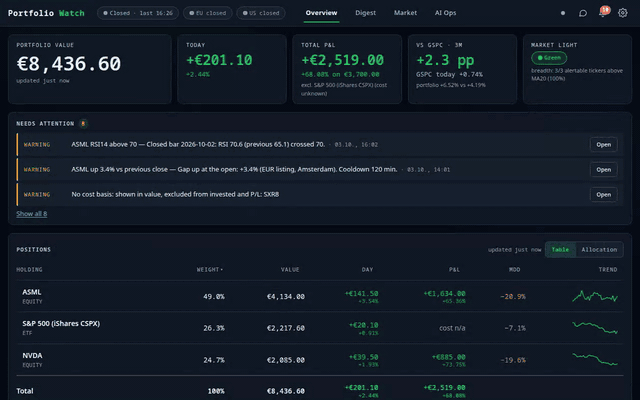

# Portfolio Dashboard – documentation

A single-user, LAN-only dashboard for a small EUR portfolio: live valuation, benchmark comparison,
alerts and push notifications, and a local-LLM analysis/digest pipeline.

> **All screenshots and videos in this documentation are generated from a throw-away demo instance with
> fictional positions and demo credentials** (see [Demo data and media](demo-data.md)). They contain no real
> holdings, amounts, credentials or network details.

*First 26 s: positions, allocation, holding detail, ranges and overlays. The full 60 s video ([walkthrough.mp4](media/video/walkthrough.mp4)) continues with the alert center, Digest, Market, AI Ops and the settings/theme switch.*

## Feature guide

| Page | What it covers |
|---|---|
| [Overview and positions](features/overview.md) | Hero stats, "Needs attention", positions table / allocation donut, portfolio vs benchmark |
| [Holding detail and charts](features/holding-detail.md) | Per-holding price chart, ranges, EMA / RSI overlays, position and valuation cards, AI analysis history |
| [Alerts and notifications](features/alerts.md) | Alert center drawer, alert rules, push delivery with the durable outbox |
| [Digest and scoreboard](features/digest-and-scoreboard.md) | Latest advice cards, failures, the scoreboard that grades past advice against realised returns |
| [AI analysis and reports](features/analysis-and-reports.md) | Quick / standard / deep modes, the report viewer, evidence gaps |
| [Market view](features/market.md) | Market light, macro (yield curve, CFTC COT), earnings, insider feed, short volume, filings |
| [AI Ops](features/ai-ops.md) | GPU lane status and fallback, LLM budget, background workers, queue, approvals, triage, evidence pack |
| [Settings and configuration](features/settings.md) | Watchlist, positions, alert rules, appearance; where the config lives and how it is protected |
| [Mobile and themes](features/mobile-and-themes.md) | Phone layout with the detail drawer, dark / light / system theme |
| [Demo data and media](demo-data.md) | How these screenshots were produced and how to regenerate them |

## Related documents

- [README.md](../README.md) – architecture, configuration reference, run / deploy / backup, HTTP API.
- [AGENTS.md](../AGENTS.md) – maintainer/agent conventions, gates and gotchas.
- [skills/](../skills/) – step-by-step procedures (ship and verify, secrets handling, lanes and the LLM pipeline, …).
