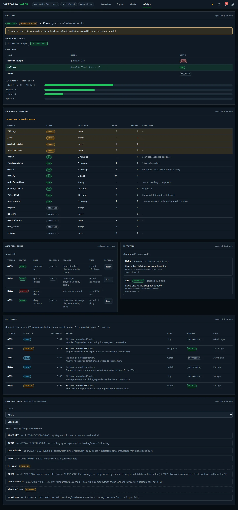

# AI Ops

[← Documentation index](../README.md)

The operator's view of the LLM side of the system.

## GPU lane

Only one heavy GPU lane runs at a time (a host-side switcher decides). The dashboard never starts or stops
lanes itself: it **probes** them in `LANE_PREFERENCE` order (default `ninfer-nvfp4`, then `exllama`) and uses the
first healthy one. The card shows which lane is *serving*, whether it is the primary or a **fallback lane**
(with a warning that quality and latency can differ), the preference order, every candidate with its model and
state (`OK`, `DOWN`, `NO_MODEL`) and the **LLM budget** for the day (total, digest, triage, other).

In the screenshot the primary lane is down, so the fallback is serving – the demo environment has no GPU, the
lane names come from a sample lane configuration.

## Background workers

Each worker follows `start()/stop()/status()/close()` and is listed with state (`OK`, `STALE`, `DISABLED`),
last run, run and error counts and a note. `STALE` means "enabled but has not run when it should have" and is
highlighted. Examples: `rule_eval` (alert rules), `price_alerts`, `notify` / `notify_outbox` (delivery),
`scoreboard`, `macro`, `edgar`, `fundamentals`, `digest`, `triage`, `kb_sync`, `ops_watch`.

## Analysis queue and approvals

- **Analysis queue** – recent jobs with ticker, status (`DONE`, `FAILED`, running), mode, decision, message
  (e.g. `lane_down: analyst`) and a **Report** button.
- **Approvals** – deep-dive proposals produced by triage. A pending approval can be acted on from the
  dashboard or from the push notification (per-approval HMAC token); abandoned ones are marked as such after the
  TTL.

## AI triage

Classifies incoming news per ticker: severity, relevance (0–1), a one-line thesis, an action hint
(`skip` / `watch` / `deep-dive`) and the outcome (`SUPPRESSED`, `PUSHED`, queued, proposal). Items below the
relevance threshold are suppressed so the push channel stays quiet.

## Evidence pack

Pick a ticker and **Load pack** to see exactly what the analysis may cite: identity, quote (with source and
as-of), technicals, news, filings, macro, fundamentals, short volume and position – each with `as_of`/`source`
or flagged `MISSING`.
