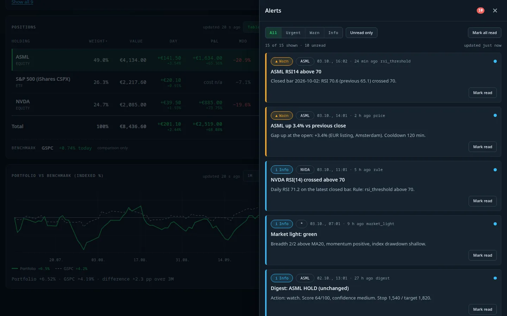
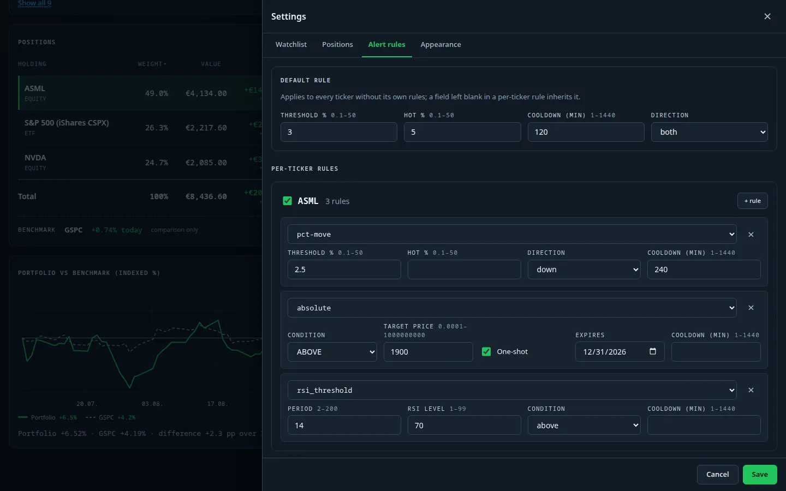

# Alerts and notifications

[← Documentation index](../README.md)

## Alert center

The bell in the header opens a drawer with every alert the dashboard has produced, newest first.

- Filters: **All / Urgent / Warn / Info** and **Unread only**; *Mark all read* or mark single alerts.
- Each card shows severity, ticker, time (absolute and relative), the *source* (`price`, `rule`,
  `rsi_threshold`, `digest`, `market_light`, …) and a short explanation with the numbers behind it.
- Unread state is kept server-side, so it is consistent across browsers and the badge count in the header
  always matches.

## Alert rules

*Settings → Alert rules* defines when alerts fire.

- **Default rule**: move threshold (%), "hot" threshold (%), cooldown in minutes and direction. It applies to
  every ticker without its own rules; a blank field in a per-ticker rule inherits the default.
- **Per-ticker rules** (add with *+ rule*, switch a ticker's rules on/off with its checkbox): percent move,
  absolute price level (above/below, optional one-shot and expiry date), RSI threshold, and further kinds such
  as EMA cross, volume spike, earnings lead time, short-ratio spike and market-light drop.
- Session moves and gaps are measured against the *previous close of the EUR listing*, so a gap is a real
  opening gap, not a currency artefact.
- Every rule has a cooldown to avoid repeated pushes; the `rule_eval` worker reports pushed / degraded /
  skipped counts on [AI Ops](ai-ops.md).

## Push notifications

Alerts are delivered through [ntfy](https://ntfy.sh/) with a **durable outbox**: messages are queued on disk,
retried with back-off and de-duplicated, so a restart or a temporary network outage does not lose them. The
`notify_outbox` worker shows sent / pending / dropped counts. A minimum-severity filter is configurable
(`NOTIFY_MIN_SEVERITY`, see the [README](../../README.md#configuration)); news alerts additionally hold back
during quiet hours (00:00–07:00 by default) and are flushed afterwards. Approval buttons in a push carry a
per-approval HMAC token.

In the demo instance ntfy is intentionally unreachable, so pushes sit in the outbox as *pending* – exactly
what the [AI Ops](ai-ops.md) screenshots show.
