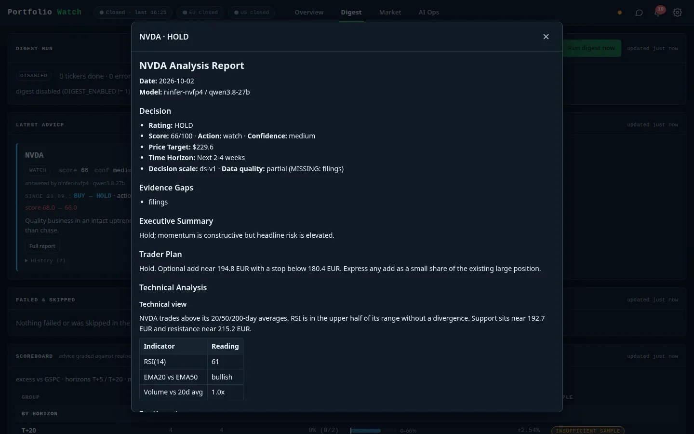

# AI analysis and reports

[← Documentation index](../README.md)

The analysis pipeline runs **in-process** on a local GPU lane (see [AI Ops](ai-ops.md)); no cloud LLM is used.
Roles: analysts → research debate → trader → risk → portfolio manager, producing a structured decision
(rating, action, score, confidence, price target, time horizon, plan).

## Modes

| Mode | Research debate | Risk review | Notes |
|---|---|---|---|
| **Quick** | none | none | Cheapest; one pass from the analysts to the portfolio manager. |
| **Standard** | 1 round (bull + bear) | none | Default for the **Analyse** button. |
| **Deep** | 2 rounds | 1 rotation (aggressive → conservative → neutral) | If earnings fall inside the configured window, the *deep_earnings* playbook is used. |

The scheduled **digest** uses its own playbook (`digest`) so the consolidated push stays short and comparable.
Each mode costs LLM turns from a daily [budget](ai-ops.md) (default 30 per day, of which 16 are reserved for
the digest and 10 capped for triage).

Start an analysis from the holding detail with **Analyse**. Jobs appear in the *Analysis queue* on AI Ops with
status, mode, decision and a **Report** button.

## Evidence pack

Every analysis cites an **evidence pack**: each field carries `as_of` and `source`, or the literal `MISSING`.
The report lists the gaps (*Evidence gaps*, here "filings"). The pack can be inspected per ticker on
[AI Ops](ai-ops.md#evidence-pack).

## Report viewer

Reports open in a modal. Markdown is rendered through DOMPurify (the CSP forbids inline scripts and styles).
A report contains: decision header (rating, score, action, confidence, price target, horizon, decision-scale
version, data quality), evidence gaps, executive summary, trader plan with entry/stop levels, technical
analysis with an indicator table, and the supporting sections. Reports are addressed as `TICKER@date` and
stored under `results/<TICKER>/full_states_log_<date>.json`.

## Chat assistant

The chat panel streams answers from the active lane. It has **no tools and no internet**: each turn receives a
DATA block with current quotes, your position and the latest advice, and the model is instructed to answer only
from that block, quote the as-of time and say so when a price is stale or missing. The chat model is selectable
in *Settings → Appearance* (default: whichever lane is live).
