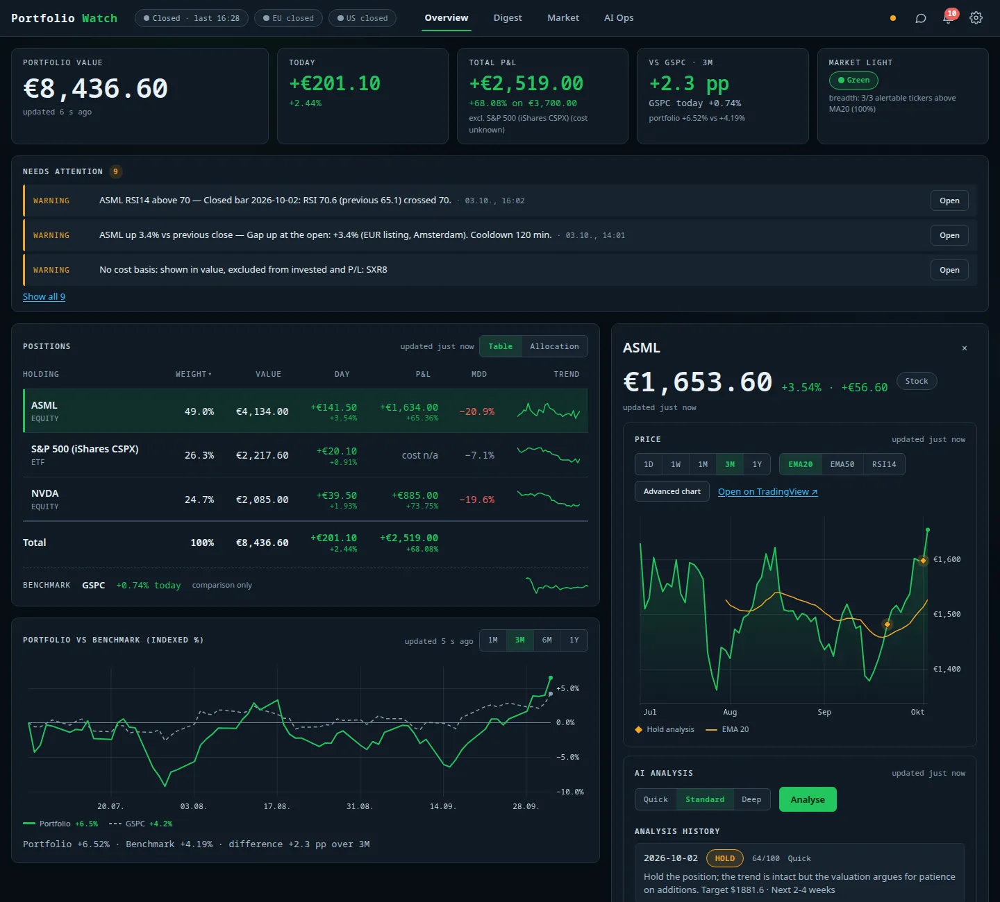
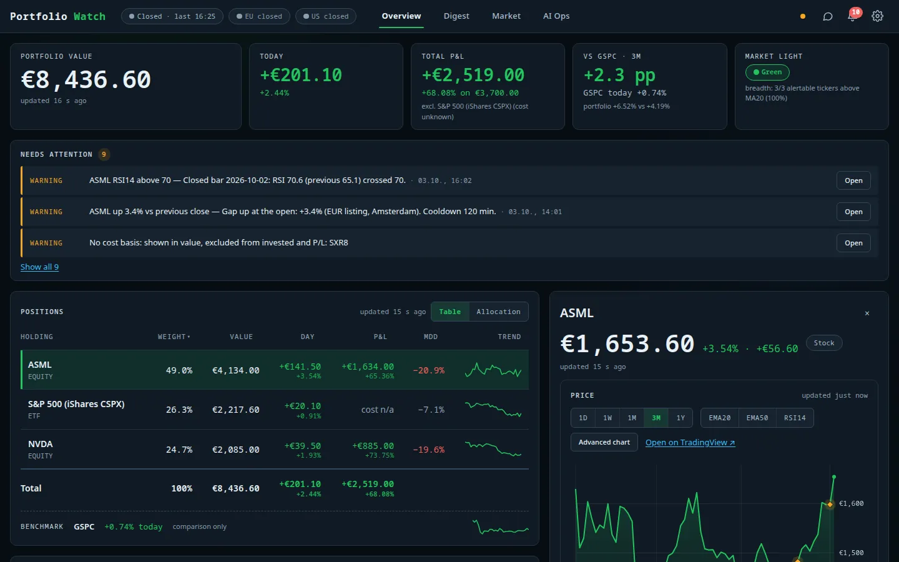

# Holding detail and charts

[← Documentation index](../README.md)

Select a row on the Overview to open the detail pane next to the table.

## Price chart

- **Ranges**: 1D, 1W, 1M, 3M, 1Y. The series is the *EUR listing* of the holding (one authoritative series per
  holding); US live feeds are only shown as a labelled `usLive` reference.
- **Overlays**: EMA20, EMA50 and RSI14 (computed server-side from closed daily bars).
- **Analysis markers**: diamonds mark days on which an AI analysis was produced (legend: *Hold analysis*).
- **Advanced chart** opens the TradingView advanced-chart widget in a modal; **Open on TradingView** links out.

## Cards under the chart

| Card | Content |
|---|---|
| **Position** | Shares, value, EUR cost basis, average cost per share, P/L (EUR and %), weight, day P/L, max drawdown. |
| **Valuation & signals** | P/E, forward P/E, dividend yield, ROE, sector/industry, analyst target and recommendation from the provider/fundamentals caches, with plain-language signals (e.g. "P/E very high", "Analysts target +24 % upside"). Data that cannot be sourced is shown as missing rather than guessed. |
| **News & alerts** | Recent alerts and news for this ticker, with the rule that fired. |
| **AI analysis** | *Quick / Standard / Deep* mode selector, **Analyse** button and the analysis history (rating, score, mode, one-line summary, price target). See [AI analysis and reports](analysis-and-reports.md). |

On a phone the same content opens as a full-height drawer – see [Mobile and themes](mobile-and-themes.md).
