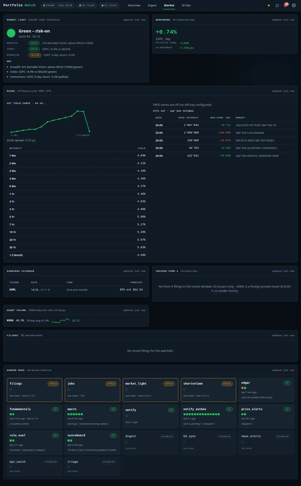

# Market view

[← Documentation index](../README.md)

All panels show an "updated … ago" stamp and degrade to an explicit empty state instead of hiding when a source
is off or has nothing to report.

| Panel | Content |
|---|---|
| **Market light** | Green / yellow / red regime with a score and the reasons: *breadth* (share of alertable tickers above their MA20), *index* (benchmark vs its MA200) and *momentum* (5-day benchmark return). A change of colour raises an alert. |
| **Benchmark** | Benchmark day move, portfolio day move and the difference. Comparison only – never an alert source. |
| **Macro** | US Treasury yield curve (table + curve, with the 2s10s spread) and CFTC Commitments-of-Traders positioning for S&P 500 futures. FRED series are optional (`FRED_API_KEY`); the panel says so when they are off. |
| **Earnings calendar** | Next earnings date, time and EPS estimate per watchlist ticker. |
| **Insider (Form 4)** | SEC Form 4 filings for US issuers; foreign private issuers (6-K / 20-F filers) are explained rather than shown empty. |
| **Short volume** | FINRA daily short-volume ratio with a 30-day average and sparkline, for US listings. |
| **Filings** | SEC watchlist events (8-K and similar). |
| **Worker runs** | One dot per recent run of each background worker, with last/next run and notes – the same data as [AI Ops](ai-ops.md), in compact form. |

Most panels are filled by background workers (`macro`, `edgar`, `filings`, `shortvolume`, `market_light`) that can
be switched on or off with the `*_ENABLED` variables (see the [README](../../README.md#configuration)).
