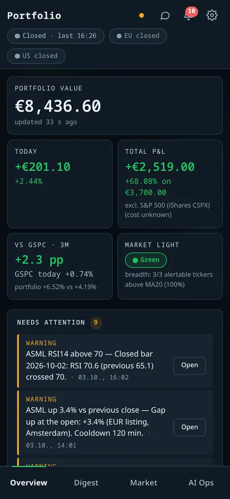
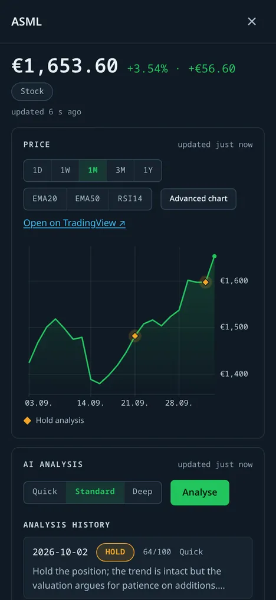

# Mobile and themes

[← Documentation index](../README.md)

## Phone layout

The UI is responsive (the screenshots and the integration test use a 390 px-wide phone viewport). Navigation moves to a bottom tab bar, the hero cards form a two-column
grid, and selecting a holding opens the detail as a full-height **drawer** instead of a side pane (no horizontal
overflow – this is covered by an integration test).

| Overview | Holding drawer |
|---|---|
|  |  |

## Themes

*Settings → Appearance* offers **System**, **Light** and **Dark**. The choice applies immediately, is stored in
`localStorage` (key `pd.theme`) and is applied before first paint by a tiny classic script, so there is no flash
of the wrong theme.

| Dark | Light |
|---|---|
|  |  |
