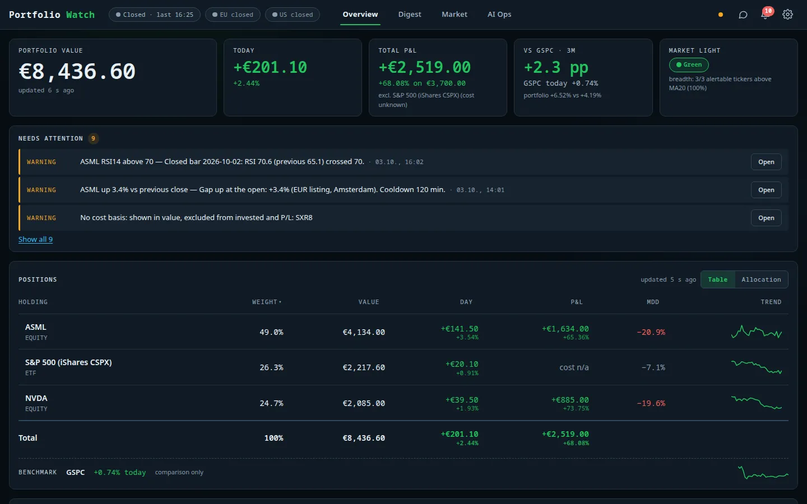
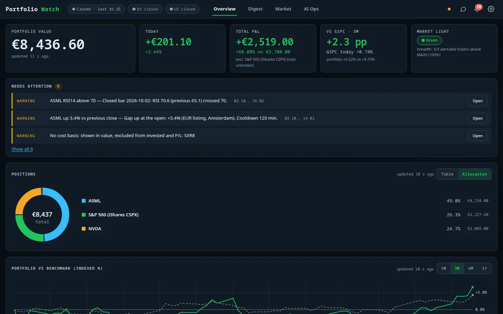
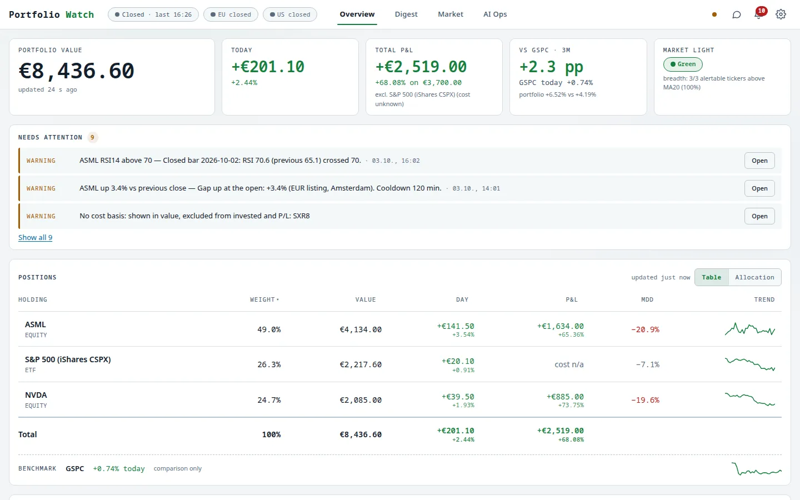

# Overview and positions

[← Documentation index](../README.md)

The **Overview** tab is the landing page: one glance tells you what the portfolio is worth, how today went,
how it compares with the benchmark, and what needs your attention.

*Demo data only: ASML, NVDA and an S&P 500 UCITS ETF with fictional share counts and cost bases.*

## Header

- **Session chips** – `Closed · last 16:25`, `EU closed`, `US closed`: venue-aware market hours, so a quiet
  price is not mistaken for a broken feed.
- **Tabs** – Overview, Digest, Market, AI Ops.
- **Status dot, chat, alert bell, settings** – the bell shows the unread alert count (see [Alerts](alerts.md));
  the speech-bubble opens the grounded chat assistant; the cog opens [Settings](settings.md).

## Hero stats

| Card | Meaning |
|---|---|
| **Portfolio value** | Σ shares × the EUR listing price. All amounts are EUR. |
| **Today** | Day P/L in EUR and percent. |
| **Total P&L** | Value minus the EUR cost basis. Positions *without* a known cost basis are valued but **excluded** from invested capital and P/L (and flagged), so P/L is never silently wrong. |
| **vs benchmark · 3M** | Percentage-point difference between the portfolio and the benchmark (S&P 500, converted to EUR) over the selected window. |
| **Market light** | Green / yellow / red regime from breadth, index trend and momentum – details on the [Market](market.md) tab. |

## Needs attention

Open alerts and data-quality warnings, most important first (here: an RSI cross, an opening gap, and a
"no cost basis" notice for the ETF). **Open** jumps to the holding; **Show all** opens the alert center.

## Positions

- **Table** – weight, value, day P/L, total P/L, max drawdown (MDD) and a trend sparkline per holding, plus a
  total row and a benchmark row (shown for comparison only – it never produces alerts or analysis).
- **Allocation** – donut with the weight of each holding.
- Click a row to open the [holding detail](holding-detail.md) beside the table (a drawer on phones).
- A holding with an unknown cost basis shows `cost n/a` instead of a P/L.
- A `stale` chip appears on a row when its last quote is older than expected (market closed or feed lagging);
  a warning in *Needs attention* lists the affected holdings.

## Portfolio vs benchmark

An indexed chart (both series start at 0 %) over 1M / 3M / 6M / 1Y. The benchmark is converted to EUR with
daily FX because the ETF listing is not currency-hedged, so the comparison is like-for-like.

## Light theme

Theme choice (System / Light / Dark) is in *Settings → Appearance* and is stored in the browser only.
