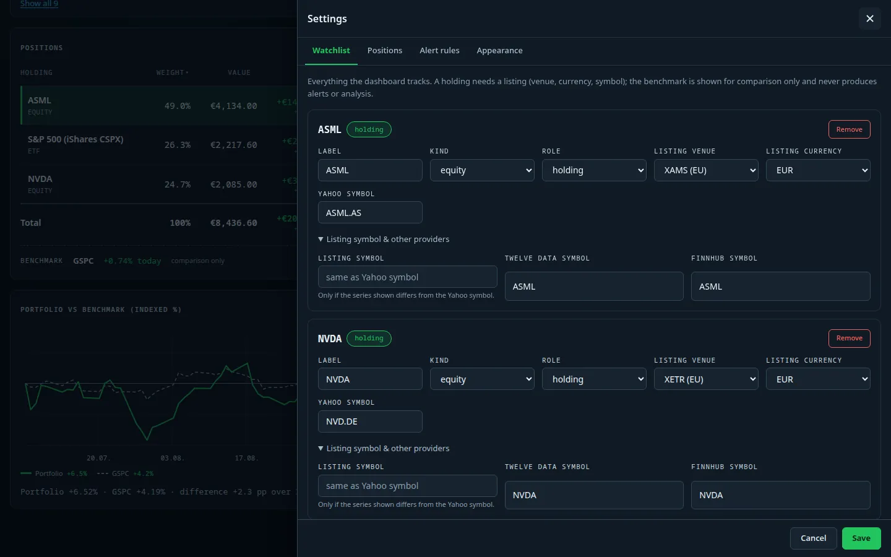
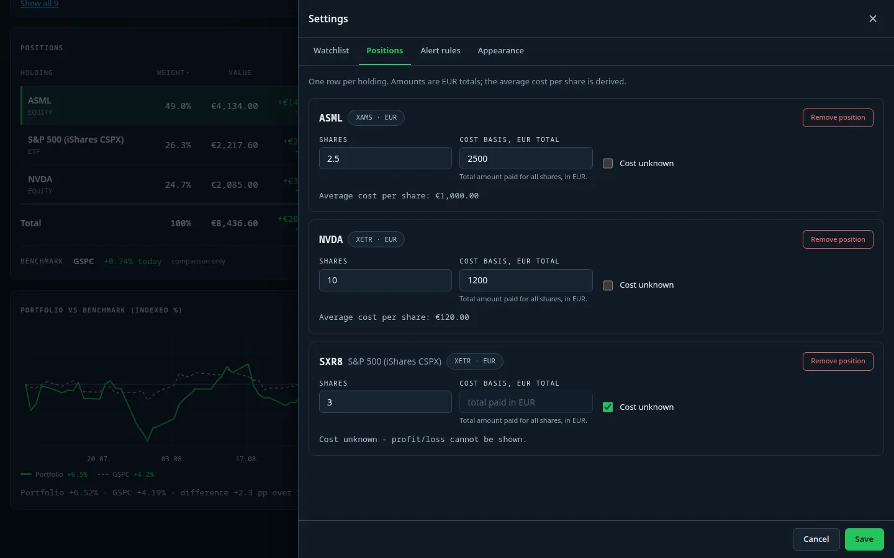

# Settings and configuration

[← Documentation index](../README.md)

*Settings* (cog in the header) edits the same `config/config.json` that you can also edit by hand. Saving writes
atomically and keeps a last-good copy, so a bad save cannot take the dashboard down.

## Watchlist

Everything the dashboard tracks. A holding needs a **listing** – venue, currency and symbol – because valuation,
charts and alerts all use the EUR listing. Per entry: label, kind (e.g. equity, etf, index), role (`holding`,
`benchmark`), listing venue and currency, the Yahoo symbol and – under *Listing symbol & other providers* – an
override for the listing symbol and the Twelve Data / Finnhub symbols. The **benchmark** is shown for comparison
only and never produces alerts or analysis.

## Positions

One row per holding: **shares** and **EUR cost basis (total paid)**. The average cost per share is derived.
Tick *Cost unknown* when you do not know it: the position is still valued but excluded from invested capital
and P/L, and the dashboard says so (see [Overview](overview.md)).

## Alert rules

Default rule plus per-ticker rules – see [Alerts and notifications](alerts.md#alert-rules).

## Appearance

Theme (System / Light / Dark, stored in the browser only), the chat model, and an *About* block.

## Where the data lives

| Item | Location | In Git? |
|---|---|---|
| Tickers, positions, alert rules | `config/config.json` (bind-mounted directory) | **No** (gitignored); `config/config.example.json` is a fictional sample |
| Credentials and feature flags | `env.secrets` (systemd `EnvironmentFile`) | **No** |
| Runtime state | `data/` | No |
| Analysis reports | `results/` | No |

`ops/deploy.sh` snapshots the config before a rebuild, refuses to deploy without a valid one and verifies it is
unchanged afterwards; `ops/restore-config.sh` restores it. Details in the
[README](../../README.md#run-build-deploy) and [`skills/ship-and-verify`](../../skills/ship-and-verify/SKILL.md).
